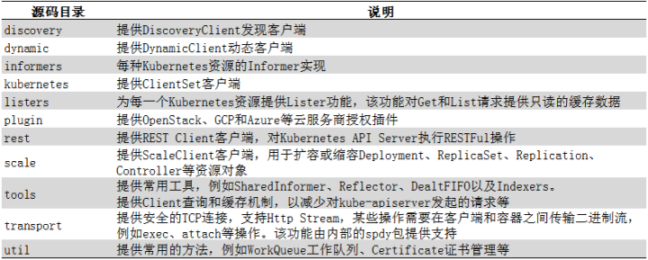

### client-go 介绍
Kubernetes 系统使用 client-go 作为 go 语言的官方编程式交互客户端库，提供对 Kubernetes API Server 服务的交互访问。

### client-go 源码目录如下：


### 客户端对象
初始化客户端需要的配置 rest.Config
```go
// Config holds the common attributes that can be passed to a Kubernetes client on
// initialization.
//Config包含可在初始化时传递给Kubernetes客户端的通用属性
type Config struct {
	// Host must be a host string, a host:port pair, or a URL to the base of the apiserver.
	// If a URL is given then the (optional) Path of that URL represents a prefix that must
	// be appended to all request URIs used to access the apiserver. This allows a frontend
	// proxy to easily relocate all of the apiserver endpoints.
	Host string
	// APIPath is a sub-path that points to an API root.
	APIPath string
	// ContentConfig contains settings that affect how objects are transformed when
	// sent to the server.
	ContentConfig
	// Server requires Basic authentication
	Username string
	Password string `datapolicy:"password"`
	// Server requires Bearer(承载者) authentication. This client will not attempt to use
	// refresh tokens for an OAuth2 flow.
	// TODO: demonstrate an OAuth2 compatible client.
	BearerToken string `datapolicy:"token"`
	// Path to a file containing a BearerToken.
	// If set, the contents are periodically read.
	// The last successfully read value takes precedence over BearerToken.
	BearerTokenFile string
	// Impersonate(模仿) is the configuration that RESTClient will use for impersonation.
	Impersonate ImpersonationConfig
	// Server requires plugin-specified authentication. 
	// 服务器需要插件指定的身份验证
	AuthProvider *clientcmdapi.AuthProviderConfig
	// Callback to persist config for AuthProvider.
	AuthConfigPersister AuthProviderConfigPersister
	// Exec-based authentication provider.
	ExecProvider *clientcmdapi.ExecConfig
	// TLSClientConfig contains settings to enable transport layer security
	TLSClientConfig
	// UserAgent is an optional field that specifies the caller of this request.
	UserAgent string
	// DisableCompression bypasses automatic GZip compression requests to the
	// server.
	DisableCompression bool
	// Transport may be used for custom HTTP behavior. This attribute may not
	// be specified with the TLS client certificate options. Use WrapTransport
	// to provide additional per-server middleware behavior.
	Transport http.RoundTripper
	// WrapTransport will be invoked for custom HTTP behavior after the underlying
	// transport is initialized (either the transport created from TLSClientConfig,
	// Transport, or http.DefaultTransport). The config may layer other RoundTrippers
	// on top of the returned RoundTripper.
	//
	// A future release will change this field to an array. Use config.Wrap()
	// instead of setting this value directly.
	WrapTransport transport.WrapperFunc

	// QPS indicates the maximum QPS to the master from this client.
	// If it's zero, the created RESTClient will use DefaultQPS: 5
	QPS float32
	// Maximum burst for throttle.
	// If it's zero, the created RESTClient will use DefaultBurst: 10.
	Burst int
	// Rate limiter for limiting connections to the master from this client. If present overwrites QPS/Burst
	RateLimiter flowcontrol.RateLimiter
	// WarningHandler handles warnings in server responses.
	// If not set, the default warning handler is used.
	// See documentation for SetDefaultWarningHandler() for details.
	WarningHandler WarningHandler
	// The maximum length of time to wait before giving up on a server request. A value of zero means no timeout.
	Timeout time.Duration
	// Dial specifies the dial function for creating unencrypted TCP connections.
	Dial func(ctx context.Context, network, address string) (net.Conn, error)
	// Proxy is the proxy func to be used for all requests made by this
	// transport. If Proxy is nil, http.ProxyFromEnvironment is used. If Proxy
	// returns a nil *URL, no proxy is used.
	//
	// socks5 proxying does not currently support spdy streaming endpoints.
	Proxy func(*http.Request) (*url.URL, error)
	// Version forces a specific version to be used (if registered)
	// Do we need this?
	// Version string
}
```